# Flutter RESTful API & Local Storage Demo
## _Practicum Week 14 — Febrian Arka Samudra (2341720066)_

This Flutter application demonstrates several essential concepts in modern mobile development:

- REST API CRUD (GET, POST, PUT, DELETE) using a custom HttpHelper
- ListView + Dismissible for swipe-to-delete functionality
- SharedPreferences for simple local storage
- Flutter Secure Storage for encrypted data
- Path Provider for reading and managing app directories
- Navigation & Detail Form for creating and editing pizza items

---  

## Application Demo Screens
### SharedPreferences, Secure Storage, and Path Provider
Question 1
**Features:**
- Track how many times the app has been opened
- Display document & cache directories
- Save encrypted user password
- Read file from app directory

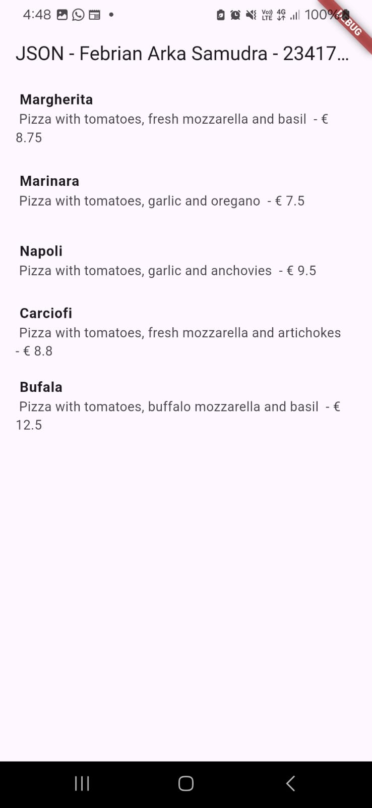
--- 
### Fetching Pizza List from REST API
Question 2

The app retrieves pizza data from a remote RESTful API using an asynchronous HttpHelper service.
The data is displayed using FutureBuilder and rendered inside a scrollable ListView. Each item includes pizza name, description, and price, automatically updated whenever the API response changes.

.png)
--- 
### Adding a New Pizza
Question 3
Users can add new pizza items through a dedicated Pizza Detail Form.
The form supports:

- entering a name, description, and price
- validating the input
- sending a POST request to the REST API
After saving, the item is sent to the server and the pizza list updates immediately.
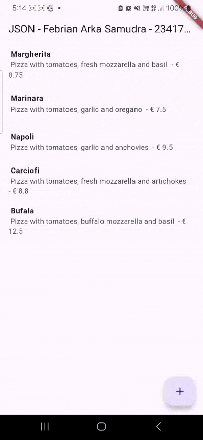
--- 
### Swipe to Delete (Dismissible)
Question 4
Each pizza entry supports swipe to delete using Flutter's Dismissible widget.
When the user swipes an item:

- it is instantly removed from the user interface
- a DELETE request is sent to the REST API
- a confirmation snackbar appears

This interaction creates a smooth and intuitive deletion workflow.
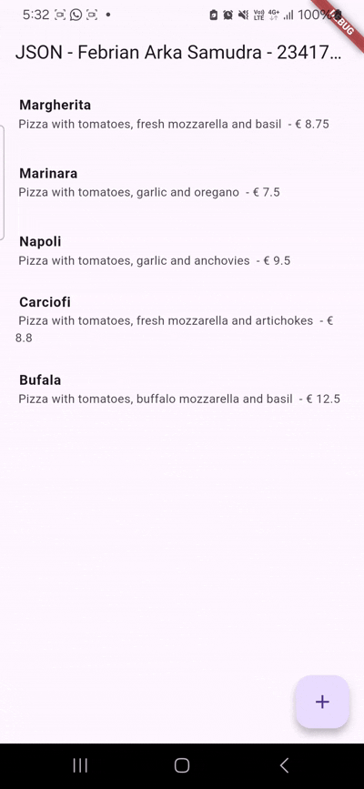

# 📘 WEEK 13 – JSON, SharedPreferences, Filesystem & Encryption in Flutter

## Practicum 1 – Converting Dart Model to JSON

### Task 1
- Added nickname to the app title.
- Changed the app theme color to my favorite color (red).
- Commit message: **"W13: Task 1 Answer"**

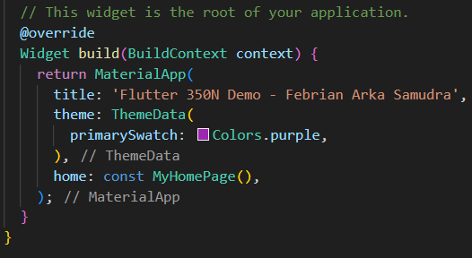
Done - Theme successfully changed to red.

---

### Task 2
- Insert the captured screenshot into the practicum report.
- Commit message: **"W13: Task 2 Answer"**

**Result:**  
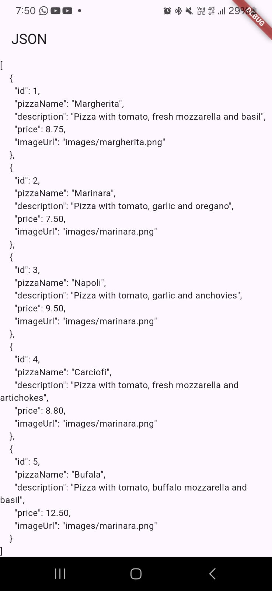
---

### Task 3
- Insert the captured screenshot into the practicum report.
- Commit message: **"W13: Task 3 Answer"**

**Result:**  
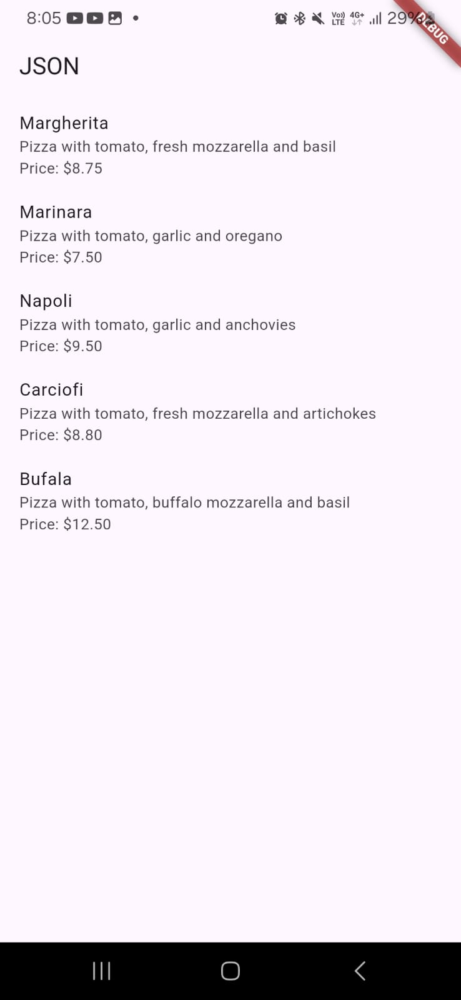
.png)

---

## Practicum 2 – Handling JSON Data Compatibility

### Task 4
- Capture the output of the running application.
- Insert it into the practicum report.
- Commit message: **"W13: Task 4 Answer"**

**Result:**  

---

## Practicum 3 – Handling JSON Errors

### Task 5

#### Safe Code  
The code is considered safer because it validates incoming data, handles null values, prevents unexpected crashes, and manages parsing errors properly. This ensures the app remains stable even when receiving incomplete or invalid data.

#### Maintainable Code  
The code is more maintainable due to its clear structure, readable naming, and separation of responsibilities. Other developers can easily understand the code, update it, and extend it without breaking other parts of the system.

**Result:**  
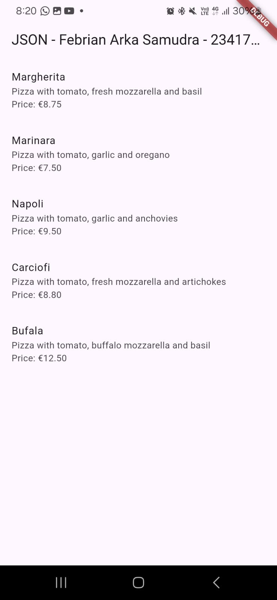

- Commit message: **"W13: Task 5 Answer"**

---

## Practicum 4 – Using SharedPreferences

### Task 6
- Capture the practicum result as a GIF and attach it to the README.
- Commit message: **"W13: Task 6 Answer"**

📸 **GIF Result:**  
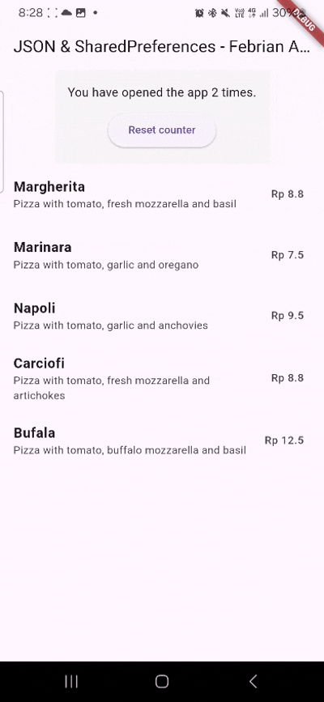

---

## Practicum 5 – Accessing Filesystem (path_provider)

### Task 7
- Capture the practicum result and attach it to the README.
- Commit message: **"W13: Task 7 Answer"**

**Result:**  
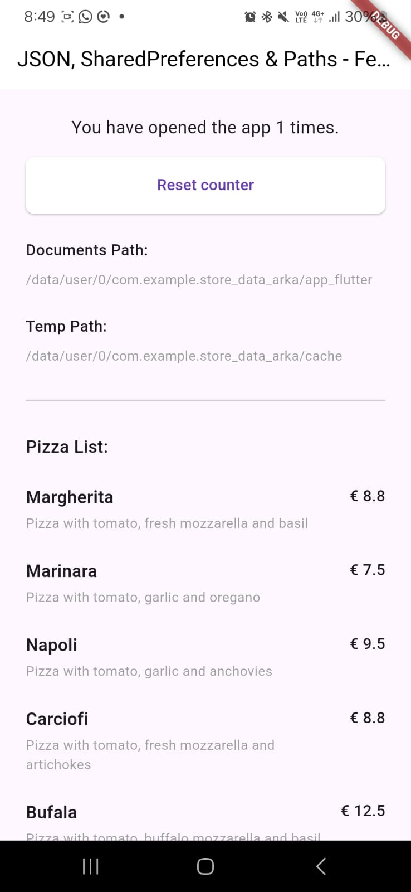

---

## Practicum 6 – Read/Write File (path_provider)

### Task 8

#### Explanation of Step 3 (writeFile)
The `writeFile()` function saves text into a file using `writeAsString()`. Because it uses `await`, the writing process completes before the next line is executed. If successful → it returns `true`. If an error occurs, the `catch` block prevents the app from crashing and returns `false`.

#### Explanation of Step 7
When pressing the **Read File** button, the application reads the file contents and displays:
- My name  
- My student ID (NIM)  
- The pizza menu  

**GIF Result:**  
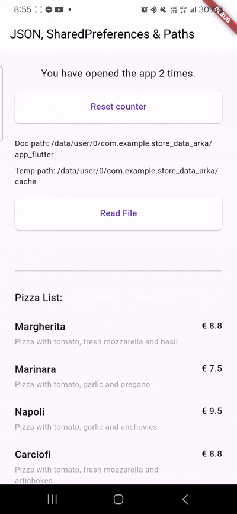

- Commit message: **"W13: Task 8 Answer"**

---

## Practicum 7 – Storing Encrypted/Decrypted Data

### Task 9
- Capture the practicum result as a GIF and attach it to the README.
- Commit message: **"W13: Task 9 Answer"**

**GIF Result:**  
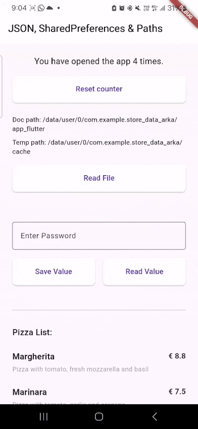

---

